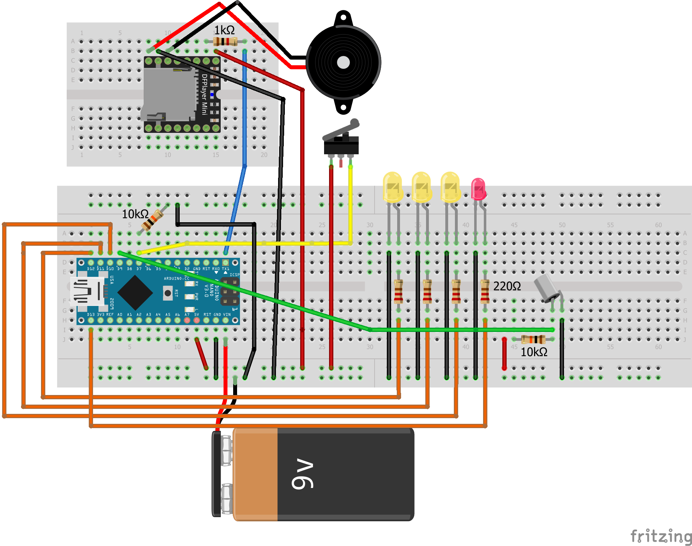

 # Thermal Detonator Prop using TinyGo

 *"because he is holding a thermal detonator!"*

  

 ## Software

 Plug in your Arduino Nano to your computer, identify the COM port and execute the following:
 
 ```
 tinygo flash -target arduino -port COM<insert number> .
 ```

 Note: You will need to unplug the dfminiplayer from the RX, TX pins before flashing 

 ## Construction

 

 ### Parts list

 * Arduino Nano
 * Dfminiplayer
 * Speaker
 * Resistors (1K, 10K, 220)
 * Rolling Switch
 * 9V battery, with connector


 ## References

https://github.com/Galactic-Empire-Props/Arduino-Thermal-Detonator-V1.0

Audio files

https://www.galacticprops.co.uk/detonator_fonts.html

DFMiniplayer info
https://wiki.dfrobot.com/DFPlayer_Mini_SKU_DFR0299
https://alainsprojects.com/2020/03/06/df-player-mini-configuration/